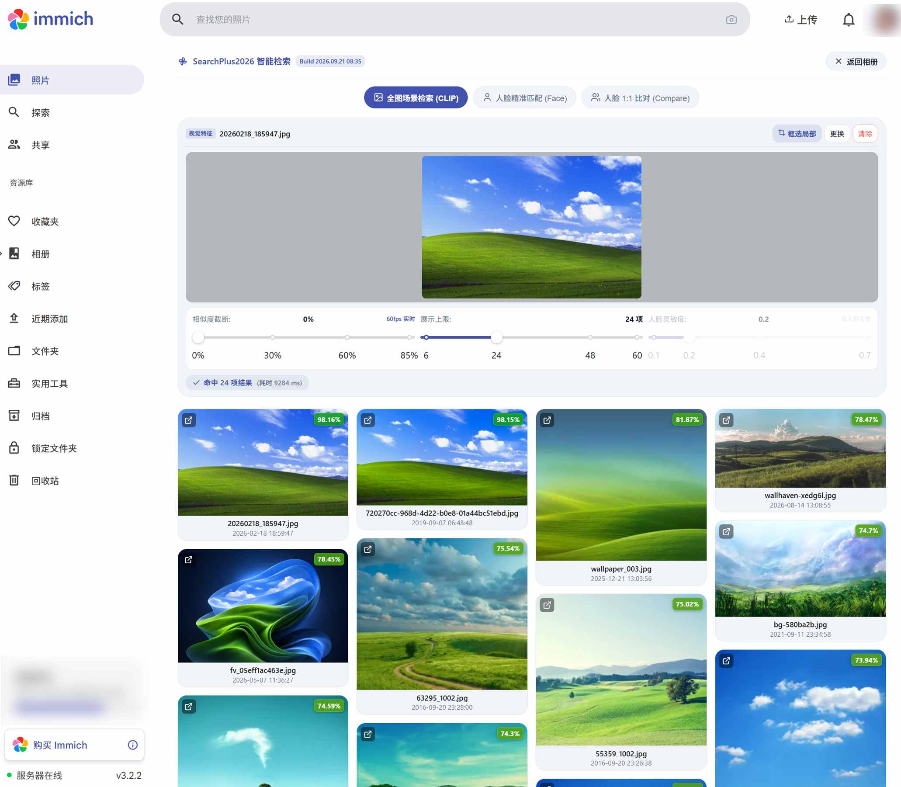
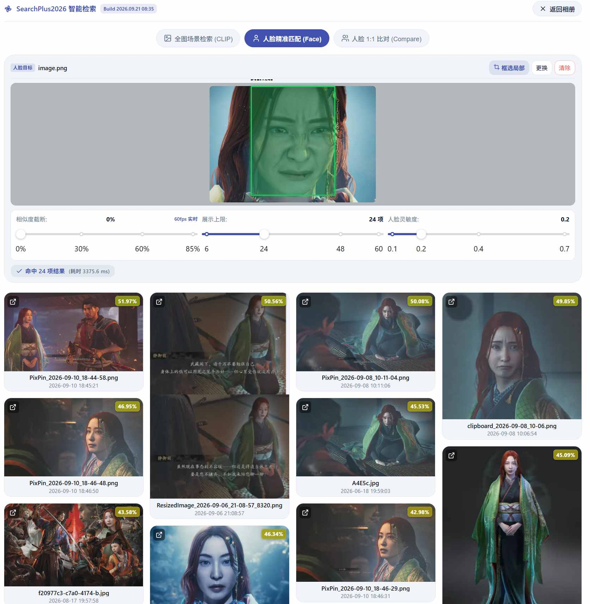

> A companion service built for self-hosted Immich albums, featuring reverse image search, face search, and 1:1 face similarity comparison.

> [!NOTE]
> This documentation was translated by AI and may contain inaccuracies or omissions. Corrections and improvements via Pull Requests are warmly welcome!

<div align="right">

[简体中文](./README.md) | **English**

</div>

> [!TIP]
> 中文文档请参见 [README.md](./README.md)。

## What This Project Adds to Immich

1. Search for similar photos in your album using an image of your choice, without needing to upload the image to your library.
2. Search for matching people across your album using an image containing faces, without needing to upload the image to your library.
3. Additional feature: Compare 1:1 similarity between two faces, without needing to upload the images to your library.





> [!TIP]
>
> ## Important Notes
>
> 1. Prerequisites: Your Immich machine learning photo search is currently working properly.
> 2. How it works: Directly connects to Immich's database and Immich machine learning service to achieve reverse image search > (CLIP), multi-target face search, and 1:1 feature comparison.
> 3. Usage: Can be used as a standalone web page or embedded directly into Immich's web interface.
> 4. Development environment: Built and tested based on Immich 3.2.2.

> [!WARNING]
> **Disclaimer & Assumption of Risk**
>
> 1. This project is provided on an **"AS-IS"** basis, without warranties of any kind, express or implied.
> 2. **All consequences** resulting from deployment, configuration, direct database connection, and usage **(including but not limited to corruption or loss of photo assets, database crashes, hardware overheating, security breaches, etc.) are 100% assumed by the user**. The authors and contributors bear no direct or indirect legal liability.
> 3. Your self-hosted photo library is invaluable. Before deploying any third-party extensions, please strictly follow the officially recommended **3-2-1 backup strategy**!

---

## ✨ Core Features

- 🖼️ **Reverse Image Search (CLIP)**: Search for photos using an image directly without uploading it to your library first! Hooray!
- 👤 **Multi-Target Face Matching (InsightFace)**: Automatically detects face locations with multi-selection support, scanning and retrieving all photos of the same person across the entire album.
- 👥 **Independent 1:1 Face Comparison**: Ultra-fast cosine similarity comparison between two sample faces. Supports standalone access via an exclusive secret key without logging into the album (visit `?app=compare`).
- ⚡ **Native Viewport Takeover**: Seamlessly embeds into the native Immich navigation bar via a lightweight script, supporting mobile back gestures and timeline repositioning on back navigation.
- 🛡️ **Read-Only Sidecar Safety**: Connects to the pgvector database in read-only mode without performing any write operations. Features built-in concurrency queuing, computational cooldown, and circuit breaker protection.

---

## 🚀 Deployment Methods (Choose One)

### Method 1: Run Standalone Linux x86_64 Binary Directly

#### 1. Download the Binary

Download the binary into a directory.

#### 2. Create the `.env` Environment File in the Same Directory

Create a `.env` file in the same directory and fill in your actual Immich address and database password:

```
# =================================================================
# Immich Infrastructure Connection (Direct connection via Docker Compose service names)
# =================================================================
IMMICH_SERVER_URL=http://immich-server:2283
IMMICH_ML_URL=http://immich-machine-learning:3003/predict
IMMICH_DB_HOST=database
IMMICH_DB_PORT=5432
IMMICH_DB_NAME=immich
IMMICH_DB_USER=postgres
IMMICH_DB_PASSWORD=your_database_password_here

# =================================================================
# Machine Learning Model Configuration (Must match the models running in Immich)
# =================================================================
IMMICH_CLIP_MODEL=nllb-clip-large-siglip__v1
IMMICH_FACE_MODEL=antelopev2

# =================================================================
# Service Runtime Parameters & Security Keys
# =================================================================
PORT=1880

# Dedicated standalone authorization key for 1:1 face comparison (Optional, allows access via ?app=compare)
# IMMICH_COMPARE_API_KEY=your_custom_secret_key_here
```

Also supports `config.json` and `config.yaml`. Example files are provided, which can be specified using `-c`.

### 3. Run the Binary File to Test

### Method 2: Docker Compose Container Deployment (Placeholder for now, do not use)

Append the following service definition under the `services:` section in your existing Immich `docker-compose.yml`:

```yaml
services:
  immich-searchplus2026:
    # Option A: Pull pre-built image from GitHub Container Registry
    image: ghcr.io/<your_github_username>/immich-searchplus2026:latest
    # Option B: Build from local source
    # build:
    #   context: ./mine-search
    #   dockerfile: Dockerfile
    container_name: immich-searchplus2026
    restart: always
    ports:
      - "1880:1880"
    environment:
      # Database connection (reusing Immich environment variables directly)
      - IMMICH_DB_HOST=database # Database host
      - IMMICH_DB_PORT=5432 # Database port
      - IMMICH_DB_NAME=${DB_DATABASE_NAME:-immich} # Database name
      - IMMICH_DB_USER=${DB_USERNAME:-postgres} # Database user
      - IMMICH_DB_PASSWORD=${DB_PASSWORD} # Database password
      # Immich core microservices communication (internal service name resolution)
      - IMMICH_SERVER_URL=http://immich-server:2283 # Immich server address
      - IMMICH_ML_URL=http://immich-machine-learning:3003/predict # Machine learning service address
      # Machine learning models (must strictly match the models running in Immich)
      - IMMICH_CLIP_MODEL=nllb-clip-large-siglip__v1 # Text/Image search model name
      - IMMICH_FACE_MODEL=antelopev2 # Face recognition model name
      # Standalone secret key for 1:1 face comparison (Optional; allows access without logging into album)
      # - IMMICH_COMPARE_API_KEY=your_custom_secret_key
      - TZ=Asia/Shanghai
    depends_on:
      - database
      - immich-machine-learning
      - immich-server
```

Start the service:

```bash
docker compose up -d immich-searchplus2026
```

---

## 🌐 Integrating into the Official Immich Web Interface

### Reverse Proxy & Script Injection (Example with Nginx Proxy Manager)

Whether running via Docker or as a standalone binary, simply add the following configuration under **Advanced** rules for your Immich proxy host in NPM to enable viewport takeover and automatic script injection:

```nginx
# 1. Disable upstream gzip compression to ensure sub_filter substitution works
proxy_set_header Accept-Encoding "";

# 2. Forward SearchPlus2026 search and comparison endpoints to https://your-immich-domain/searchplus2026/
location /searchplus2026/ {
    proxy_pass http://<immich-SearchPlus2026-service-address>:1880/;
    proxy_set_header Host $host;
    proxy_set_header X-Real-IP $remote_addr;
    proxy_set_header X-Forwarded-For $proxy_add_x_forwarded_for;
    proxy_set_header X-Forwarded-Proto $scheme;
}

# 3. Automatically inject the frontend takeover script before the closing </body> tag on Immich pages
sub_filter '</body>' '<script src="/searchplus2026/inject.js"></script></body>';
sub_filter_once on;
sub_filter_types text/html;
```

### ⚠️ You can also download this `inject.js` and run it via Tampermonkey; you only need to add the standard Tampermonkey script headers.

### 💡 This script also fixes two bugs in Immich 3.2.2: the issue where the page locks and cannot be scrolled after navigating back, and the back button failing to return to the current preview image's position on the timeline.

---

## Build & Compilation

### 1. Build with Docker

#### 1. Build as a Docker Image

Run the following in the same directory as the Dockerfile:

```
docker build -t immich-searchplus2026:latest .
```

#### 2. Build and Export Binary

Run the following in the same directory as the Dockerfile:

```
DOCKER_BUILDKIT=1 docker build --target export-stage --output type=local,dest=./release .
```

Cross-compile for a specific architecture (e.g., Windows amd64):

```
DOCKER_BUILDKIT=1 docker buildx build --target export-stage --output type=local,dest=./release --build-arg TARGETOS=windows --build-arg TARGETARCH=amd64 .
```

Output files will be saved in `./release`.

### 2. Build Without Docker

---

## 📌 Notes & FAQs

1. **Strictly Match Model Names**:
   `IMMICH_CLIP_MODEL` and `IMMICH_FACE_MODEL` must match the model names currently running on your Immich instance exactly; otherwise, vector feature space mismatch will cause searches to yield no results.
2. **Integrated GPU / VRAM Considerations**:
   The AntelopeV2 face model has high peak VRAM spikes during forward inference. If using Intel integrated graphics (OpenVINO) and encountering ML container 500 errors (error code `-14`), it is recommended to reboot the host machine into the BIOS and increase the shared iGPU memory (DVMT Pre-Allocated / UMA Frame Buffer Size) to **512MB or 1024MB**.
3. **Standalone 1:1 Face Comparison Tool**:
   Visit `https://your-immich-domain/searchplus2026/?app=compare` to access the dedicated face comparison mode. If `IMMICH_COMPARE_API_KEY` is configured, users can enter this key to compare portraits directly without logging into the album.

---

## 📄 License

This project's code is licensed under the [MIT License](./LICENSE). The underlying face recognition model weights adhere to InsightFace's non-commercial research use agreement.
